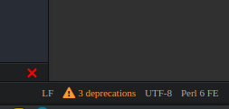

// This file created using AsciiDoc which is similar to Markdown
// Unlike Markdown, you can create comments
// Unlike Markdown, there can only be one top level (= Foo) title which in AsciiDoc
// becomes the documents name.
// Below this you must use (== Section) and deeper
= Using Atom as a Perl 6 IDE
// Options for the document's rendering are declared after the first header
// Add a Table of Contents and show it after the Preamble (AsciiDoc supports
// auto-generated Table of Contents! :-)
:toc: preamble
// Hide the URI scheme for autolinked urls
:hide-uri-scheme:

// In Markdown links are declared:
// [nav-panel-plus]: https://atom.io/packages/nav-panel-plus
// This is how AsciiDoc declares link references:
:ec-download: http://editorconfig.org/#download
:textmate-ec: https://github.com/Mr0grog/editorconfig-textmate
:vim-ec: https://github.com/editorconfig/editorconfig-vim
:emacs-ec: https://github.com/editorconfig/editorconfig-emacs
:editorconfig: http://editorconfig.org/
:editorconfig-package: https://atom.io/packages/editorconfig
:script-package: https://atom.io/packages/script
:language-perl6: https://atom.io/packages/language-perl6
:nav-panel-plus: https://atom.io/packages/nav-panel-plus

So you've started to write some code in **Perl 6**. You may now be asking yourself,
// Underline with: [underline]#underlined text#
// italicize with _italicized text_ at word boundaries. If you need to underline between words
// You can d__o it like thi__s // Though most cases you don't need to do that
"How can I make this programming experience [underline]#_more awesome_#?"

To that question, please see these enhancements to the Atom text editor.

NOTE: When installing with `apm`, the install may not take effect until Atom is restarted.
Installing from the `Install` menu should take effect in most cases, except for certain packages which actually do need Atom to be restarted.

== Syntax highlighter
// This link would be declared as [Package link for language-perl6 package][language-perl6] using
// Markdown. AsciiDoc declares the link/link reference first. And references use {} instead of []
{language-perl6}[Package link for language-perl6 package]
// Normal links are declared like: https://atom.io/packages/language-perl6[Package link for language-perl6 package]
// Instead of markdown's [Package link for language-perl6 package](https://atom.io/packages/language-perl6)

=== What does this do?
This will properly highlight various elements of your perl6 code.

=== Installation
Run `apm install **language-perl6**` in terminal or install `language-perl6` through the package manager
by pressing `Ctrl + ,` and then choosing the `Install` menu on the left side and searching. Note that you should install the plugin that is maintained by the user `perl6`.

=== How do I use this?
This language grammar should automatically highlight `.p6`, `.pod6`, `.pm6` and
`.nqp` files. The language grammar will also detect files whose first
line includes `use v6`, a shebang whose last term before any whitespace is
`perl6` , `=begin pod`, or `my class`.

If you need to manually set it, click on the on the bottom right corner of Atom and select `Perl 6 FE`:
// images with image:: need an empty line above it
// images with image: (only one colon) are inline instead of block — they also don't need any whitespace before them



=== Note
If you are having issues, the `language-perl` package is probably taking
precedence. To remedy this you can:

* Click the language name in the status-bar (`Ctrl+Shift+L`) and select `Perl 6 FE`
* If you want to permanently change the preferences for a file type,
  add the following to your `config.cson` (*_Edit_* → *_Config_*):

// You can declare codeblocks just like markdown
```coffee
"*":
  core:
    customFileTypes: [
      'source.perl6fe': [
        'p6'
        'pm6'
        # Add pm and t if you want to auto choose this highlighter for .pm or .t
        # files.
        'pm'
        't'
      ]
    ]
```

Please be aware that if you do not include the `t` extension
above, your `t` files will be highlighted with the `language-perl` highlighter unless the first line contains `use v6;`.

If you do not ever expect to write Perl 5 code, then you may as well make these changes.

== Perl 6 code execution
{script-package}[Link to script package on atom.io]

=== What does this do?
This will allow you to execute portions of your code that you highlight with your cursor as if it was run on the command line.

=== Installation
// Unlike markdown, you can stylize text inside single backticks
// Link to a section with <<Section name, Link text>>
Run `apm install **script**` and install the <<Syntax highlighter, syntax highlighter language-perl6>> if you have not already done so.

=== How do I use this?
Make sure you have set the grammar type to `Perl 6 FE`
// images with image:: need an empty line above it


Then you can press `Ctrl + Shift + B` on Linux. For other operating systems see
the packages {script-package}[readme page].

If no text is selected it will run the file direction if the file has been saved
and you have made no modifications. If you have made changes since it was last saved,
it will run using the current text in the screen buffer. If you have text selected
it will evaluate only the selection.

== Indexing of classes, routines and operators
{nav-panel-plus}[Link to package on atom.io for nav-panel-plus package]
You can get a right panel which will show all

Routines, Classes and Operators for Perl 6 code.
// images with image:: need an empty line above it

image::images/nav-panel-plus.png[Routines, Classes and Operators can be seen in the right panel]

=== What does this do?
This will display a sidebar on the right side of the editor that lists all of the subroutines, classes, and operators in the current file. Clicking on any of these things will take you to where they are defined.

=== Installation
Run `apm install **nav-panel-plus**` or install it from the package search in Atom by pressing `Ctrl + ,` then clicking `Install` and searching for `nav-panel-plus`

=== How do I use this?
Put the file:config/.nav-marker-rules[.nav-marker-rules] in the root of a project you are working on. In your terminal go into that folder and open Atom with `atom .` or run `atom ~/path/to/your/project`. You can also go to the `File` menus and then choose `Open Folder...`

=== Note
// Strikethrough is declared like this in AsciiDoc: (GitHub flavored markdown declares like ~~this~~)
[line-through]#Eventually we will have instructions on how to make it specific to
perl6 filetypes and make it apply globally,#

We have a Pull Request that adds this functionality into the package:
https://github.com/0tho/atom-nav-panel-plus/pull/8

But for now you can use .nav-marker-rules as the instructions show. Any files
opened in that project's window will also take on
the config, even if they're in another folder, as long as they're still part of the
same `Project` context in Atom.

== editorconfig
For full details on how EditorConfig works, see {editorconfig}[editorconfig.org].

=== What does this do?
Editor agnostic per project/filetype management of indentation level,
line ending and indentation type and more.

They have packages for almost all popular editors, including {vim-ec}[vim],
{emacs-ec}[Emacs],
{textmate-ec}[TextMate] and {ec-download}[so many more].
Github also respects your EditorConfig. For example, if you use tabs for indentation, you
can set the `indent_size = 4`, when people view your project they will see it
with an indentation level of 4 in your project, instead of showing 8 indentation
levels.

Github also will respect EditorConfig when in the editing mode, if you are editing
a file on Github itself.

=== How do I use this?
You can install the plugin using `apm install **editorconfig**` in terminal or through the menus.

Place this link:config/.editorconfig[template .editorconfig file] in the root of
your project or home folder.

EditorConfig can work recursively, so you can have the EditorConfig file, which is named
`.editorconfig` in the base of your project, or you could have one in your home folder.
The site describes most of the options and provides a very good example.
Also check out the {editorconfig-package}[the package's page] for more info about
the Atom package itself.

One key thing to remember is when EditorConfig sees `root = true` then it stops
any further looking through the directorys.

== Filetype Based Icons for Tabs
You can show different icons, similar to how many browsers set each tab to have
an icon on each tab. This will be determined based on the filetype. Perl 6
documents will be distinguishable by a butterfly.

=== What does this do?
This is how it makes your tabs look: image:images/file-icons-screenshot.png[file-icons package screenshot of tab icons]

=== Installation
Run `apm install **file-icons**` or install it from the package search in Atom by pressing `Ctrl + ,` then clicking `Install` and searching for `file-icons`

=== How do I use this?
Put the file:config/.nav-marker-rules[.nav-marker-rules] in the root of a project you are working on. In your terminal go into that folder and open Atom with `atom .` or run `atom ~/path/to/your/project`. You can also go to the `File` menus and then choose `Open Folder...`
